<!DOCTYPE html>
<html lang="en" dir="ltr">
  <head>
    <meta charset="utf-8">
    <link href="stylesheet.css" rel=stylesheet>

    <title>CS194 Final Project</title>
  </head>
  <body>
    <h1>CS194 Final Project</h1>
    
Intro to Computer Vision & Computational Photography: <b>Anderson Lam, Amy Huang</b>

    

      <button type="button" name="button" ><a href="./index.html">Lightfield Camera</a></button>
      <button type="button" name="button"><a href="./image_quilting.html">Image Quilting</a></button>
      <button type="button" name="button"><a href="./gradient.html">Gradient Domain Fusion</a></button>
    

    <h2>Lightfield Camera</h2>
    
<b>Overview:</b> In this project we will be using the <a href="http://lightfield.stanford.edu/lfs.html">Stanford Light Field Archive</a>
    to reproduce <em>depth refocusing</em> and <em>aperature adjustments</em> using shifting and averaging. We followed Ren Ng's <a href="http://graphics.stanford.edu/papers/lfcamera/lfcamera-150dpi.pdf"> paper </a> as well.

    <h4>Depth Refocusing</h4>

    

    <figure>
      <figcaption>a = [-5, 1]</figcaption>
    </figure>
    

    
Faraway objects do not move as much with the different camera angles compared to closer objects- and we are able to utilize this and take into account
    the camera placement to implement the depth refocusing. We first parsed the camera index from the image file names- this was our (x, y) coordinate which we used
    measure from the index of (8, 8), the center image. The amount of shifting is calculated by multiplying by an alpha <code>Δ(x_1, y_1) = a * (x_0, y_0)</code>
      Here is the following averaged <b>amethyst</b> photos with a = -1, 0, 1 respectively
  

  

  

    <figure>
       <figcaption>a = -1</figcaption>
    </figure>
    <figure>
      <figcaption>a = 0</figcaption>
    </figure>
    <figure>
      <figcaption>a = 1</figcaption>
    </figure>
  

  

  

    
   On the right shows
    the values of a from -3 to 2. As you can see, increasing the alpha focused the front
      of the object while decreasing it focused on the back. When alpha = 0, that means we
    did not do any additional/scaled shifting- it is just an average of the dataset's images.

      Let's also look at the Jellybean and Chess dataset!
     Here is the alpha values -5 to 1 on the jellybean image dataset. We shifted our alpha
   value down because of how the jelly beans are pretty far back in the images. 

    
  

  
<b>Jellybean dataset</b>

    

    

      <figure>
         <figcaption>a = -3</figcaption>
      </figure>
      <figure>
        <figcaption>a = -1</figcaption>
      </figure>
      <figure>
        <figcaption>a =1</figcaption>
      </figure>

    

    

   
<b>Chess dataset</b>

   

   

     <figure>
        <figcaption>a = -3</figcaption>
     </figure>
     <figure>
       <figcaption>a = 0</figcaption>
     </figure>
     <figure>
       <figcaption>a = 3</figcaption>
     </figure>

   

   

   <h4>Aperature Adjustment</h4>
   

   <figure>
     <figcaption>r = [0, 10]</figcaption>
   </figure>
   

   
To implement aperature adjustment, we want to average the images perpendicular to the optical axis.
   A bigger aperature is created with more perpendicular images. We use a radius variable to indicate
   a bigger or smaller aperature. By adding images from different angles, we acculumate the rays to a certain
   part of the image, and are able to mimick the opening of aperature in a camera.
       <b>Amethyst Dataset</b>
 

   

   

     <figure>
        <figcaption>r = 0</figcaption>
     </figure>
     <figure>
       <figcaption>r = 10</figcaption>
     </figure>
     <figure>
       <figcaption>r = [0, 10]</figcaption>
     </figure>
   

   

<b>Jellybean Dataset</b>

  <figure>
     <figcaption>r = 0</figcaption>
  </figure>
  <figure>
    <figcaption>r = 10</figcaption>
  </figure>

<figure>
  <figcaption>r = [0, 11]</figcaption>
</figure>

<b>Chess Dataset</b>

  <figure>
     <figcaption>r = 0</figcaption>
  </figure>
  <figure>
    <figcaption>r = 10</figcaption>
  </figure>

<figure>
  <figcaption>r = [0, 11]</figcaption>
</figure>

<b>Summary:</b> Through this project we learned how to refocus and adjust an image after looking through already
processed images. The idea is very straightforward and makes a lot of sense, although I never would have known how
this works otherwise. 

  <button type="button" name="button"><a href="./image_quilting.html">Image Quilting</a></button>
  <button type="button" name="button"><a href="./gradient.html">Gradient Domain Fusion</a></button>

  </body>
   <h2>Image Quilting</h2>
    
<b>Overview:</b> Our goal for this project was to implement an image quilting algorithm to
    perform texture synthesis and transfer. For <em>texture synthesis</em>, we generate a larger
    image given a smaller texture sample, while <em>texture transfer</em> refers to transferring a shape
    of one object onto a texture by overlapping patterns.

<h3>Texture Synthesis</h3>

    <h4>Randomly Sampled Texture</h4>
    
We started by creating the function <code>quilt_random(sample, outsize, patchsize)</code> which
    samples a small patch from a given image and tiles the patch into a larger image. Here is the
   result on the given image set.

    

    

      <figure>
        
      </figure>
      <figure>
        
      </figure>
      <figure>
        
      </figure>
      <figure>
        
      </figure>
    

    

    
As you can see, the images do not look like a uniform texture but rather a tiling of small patches.
  

  <h4>Overlapping Patches</h4>
  
Next, we implement the method <code>quilt_simple(sample, outsize, patchsize, overlap, tol)</code>
    for autoregressive sampling. We calculate the cost as the SSD between the overlapping patch of the existing
    and generated image. To filter through a given tolerance, we are able to find lower costs using the formula <code>[y, x] = find(cost< minc*(1+tol)) </code>
    We ended up using a tolerance threshold of 0.3 

  

  

    <figure>
      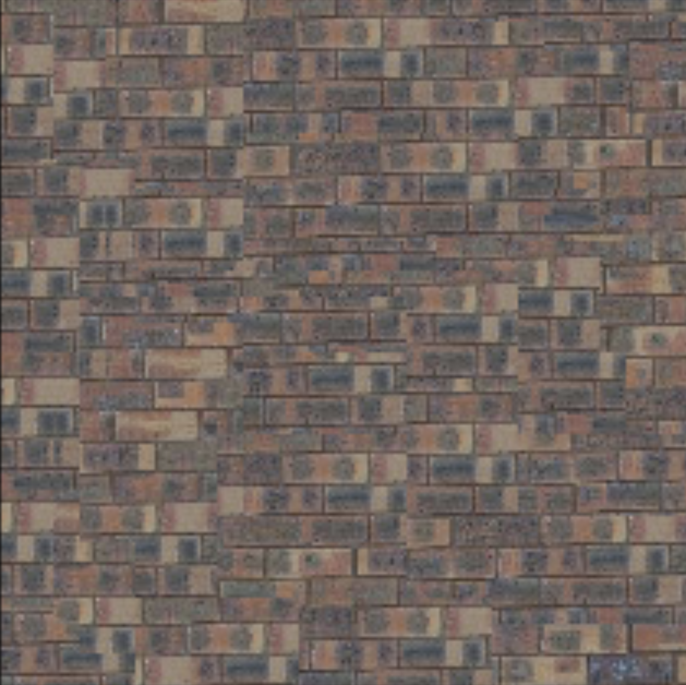
    </figure>
    <figure>
      
    </figure>
    <figure>
      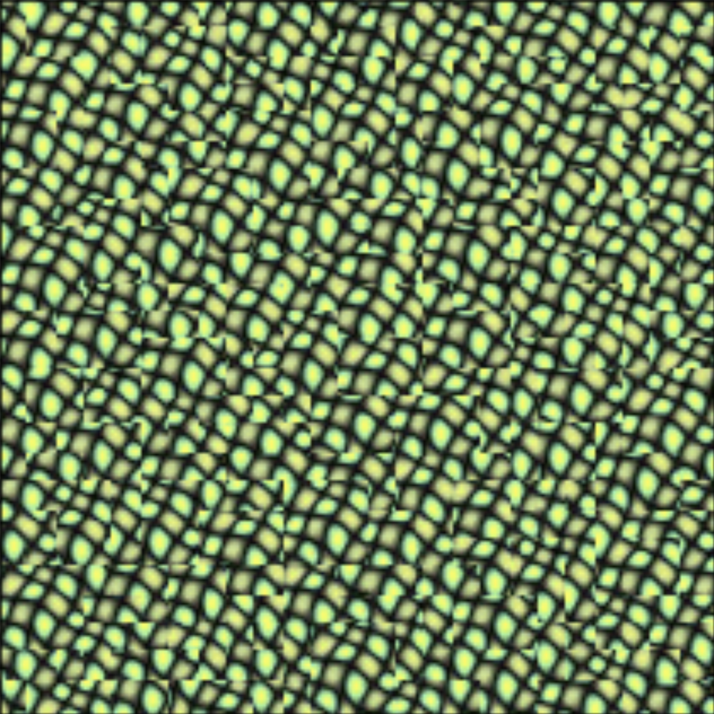
    </figure>
    <figure>
      
    </figure>
  

  

  
Although up close you can tell the different patches, there is now more variance in the texture.
  

  <h4>Seam Finding / Min Cut</h4>
  
Next, we use <em>seam finding</em> to eliminate edge artifacts from the overlapping patches.
  This is done by using a min-cost algorithm with dynamic programming. We use the min-cost path to create
  a mask in order to find which pixels to overlap. Here is the result:

  

    <figure>
      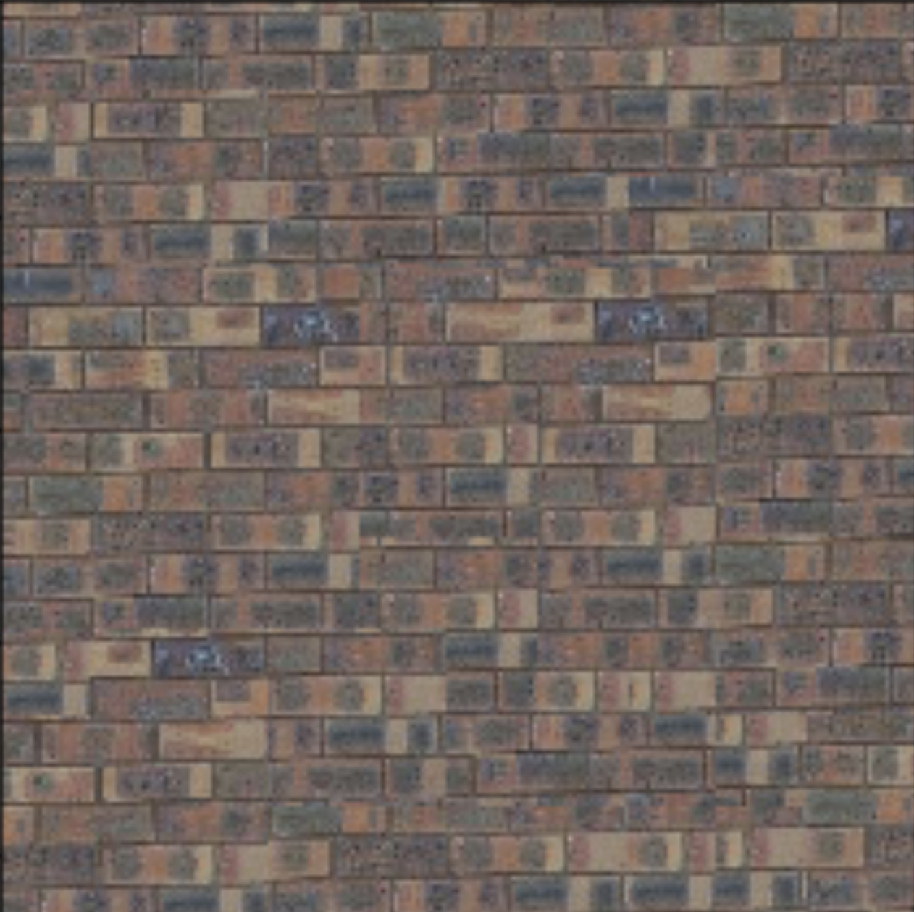
    </figure>
    <figure>
      
    </figure>
    <figure>
      
    </figure>
    <figure>
      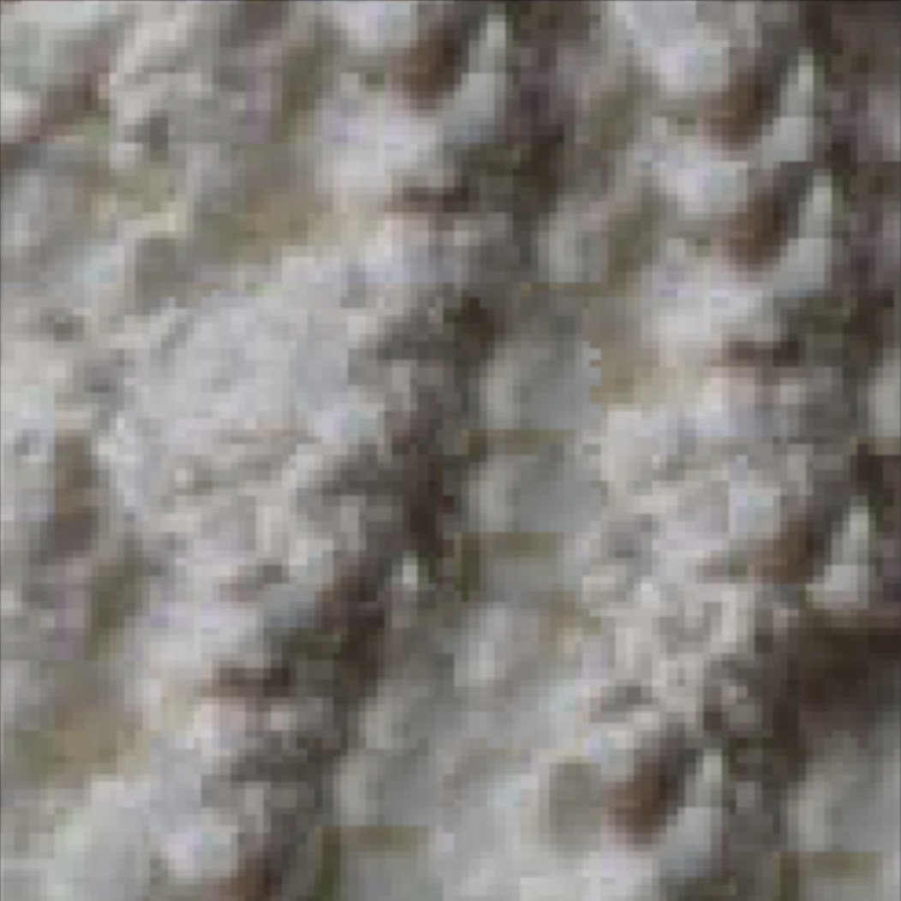
    </figure>
  

  
<b>Overlapping Min-cost Illustrations</b> 

    
 This min cost procedure is really just find our path that best aligns the two patches. We do this by computing the SSD of the patches and then run it 
    thought our DP algorithm, where we loop through our errors until we can get the lowest errors for the indicies.

  

    <figure>
      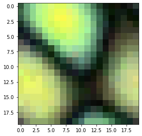<figcaption>Previous Patch</figcaption>
    </figure>
    <figure>
      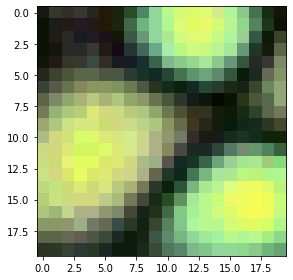<figcaption>New Patch</figcaption>
    </figure>
    <figure>
      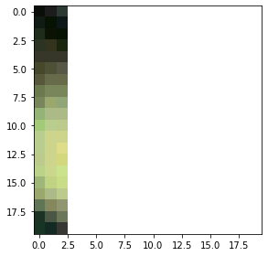<figcaption>Overlap</figcaption>
    </figure>
    <figure>
      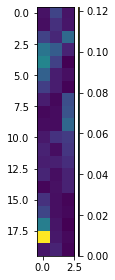<figcaption>Cost (SSD)</figcaption>
    </figure>
    <figure>
      <figcaption>Min Cost Path Result</figcaption>
    </figure>
    <figure>
      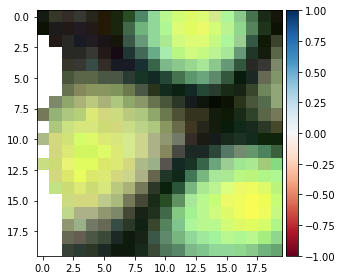<figcaption>Min Cut Result</figcaption>
    </figure>
    <figure>
      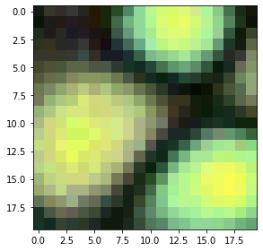<figcaption>Result</figcaption>
    </figure>
  

    
   
<b>More Examples</b> 

     

               <figure>
      <figcaption>Sky</figcaption>
    </figure>
        <figure>
      <figcaption>Sky Random</figcaption>
    </figure>
               <figure>
      <figcaption>Sky Overlap</figcaption>
    </figure>
               <figure>
      <figcaption>Sky Seam</figcaption>
    </figure>
        
       
       
                 <figure>
      <figcaption>Flowers</figcaption>
    </figure>
    <figure>
      <figcaption>Flowers Random</figcaption>
    </figure>
          <figure>
      <figcaption>Flowers Overlap</figcaption>
    </figure>
       
       
          <figure>
      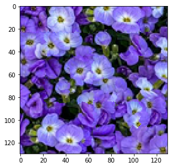<figcaption>Flowers Seam</figcaption>
    </figure>
     

  <h3>Texture Transfer</h3>
  

For texture transfer, we use our <code>quilt_cut</code> function to guide the texture cuts by using
 a reference image. We use an alpha value to multiply the weight of the cost between SSD of the patch and the
target patch of the reference image. Like the quilt_cut function, we want to find some best patch and then utilize our min cost function to blend the patches. 
  This is different than min cost as we have a texture patch and goal/target patch. We compute the SSD between these two patches to get the correct looking texture. Here are the resulting images: 

  <figure>
    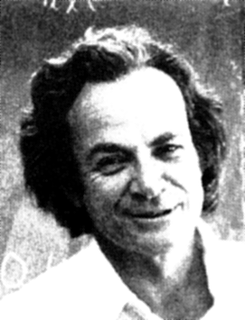<figcaption>Target Object</figcaption>
  </figure>
  <figure>
    <figcaption>Desired Texture</figcaption>
  </figure>
  <figure>
    <figcaption>Texture Transfer</figcaption>
  </figure>

  <figure>
    <figcaption>Target Object</figcaption>
  </figure>
  <figure>
    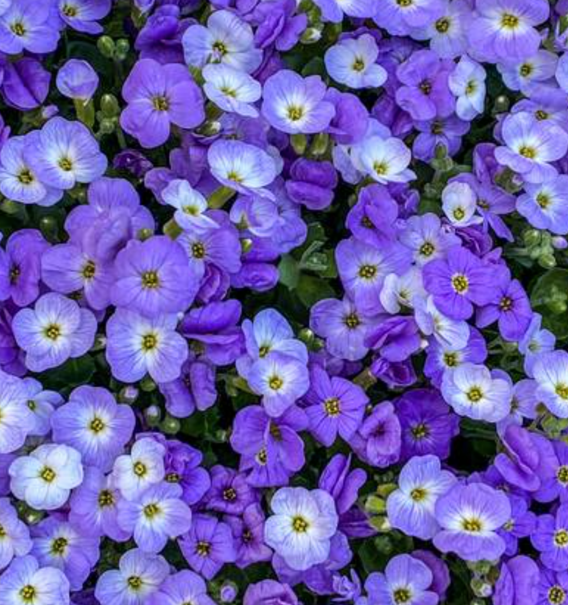<figcaption>Desired Texture</figcaption>
  </figure>
  <figure>
    <figcaption>Texture Transfer</figcaption>
  </figure>

  <figure>
    <figcaption>Target Object</figcaption>
  </figure>
  <figure>
    <figcaption>Desired Texture</figcaption>
  </figure>
  <figure>
    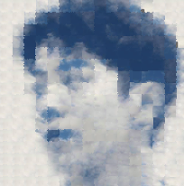<figcaption>Texture Transfer</figcaption>
  </figure>

<h3>Bells & Whistles: Iterative Texture Transfer</h3>

This portion consisted of iteratively running through our previous algorithm.
  We were able to achieve better results after running multiple times (using different
  patchsizes, overlap, and alpha values for each iteration as described in the research paper). Here are the outputs:

  <figure>
    <figcaption>Target Object</figcaption>
  </figure>
  <figure>
    <figcaption>Desired Texture</figcaption>
  </figure>
  <figure>
    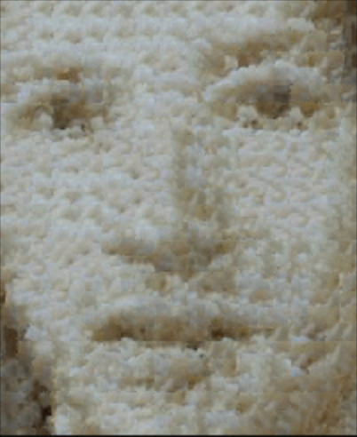<figcaption>Texture Transfer</figcaption>
  </figure>

  <figure>
    <figcaption>Regular Texture Transfer</figcaption>
  </figure>
  <figure>
    <figcaption>Iterative Texture Transfer</figcaption>
  </figure>

  <figure>
    <figcaption>Regular Texture Transfer</figcaption>
  </figure>
  <figure>
    <figcaption>Iterative Texture Transfer</figcaption>
  </figure>

<b>Summary:</b> This project was difficult to understand early on. It took a good while to wrap my head around how
overlapping worked and what I could do to try and solve this problem. There was a lot of variables that I ended up trying to store
in order to properly compute where there was overlap and then finally determine the min cut path. The next part of texture transfer
seemed intimidating at first, but was really similar to the quilt cut part. Throughout this whole process, the
algorithms took very long to run, so if I had more time, I would definitely try to optimize the min cut and overlap algorithms. I definitely learned
a lot more about how pictures work.

<button type="button" name="button" ><a href="./index.html">Lightfield Camera</a></button>
<button type="button" name="button"><a href="./gradient.html">Gradient Domain Fusion</a></button>
</html>
